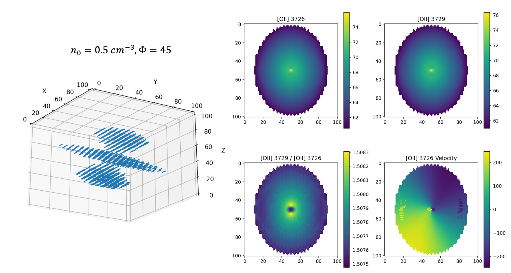
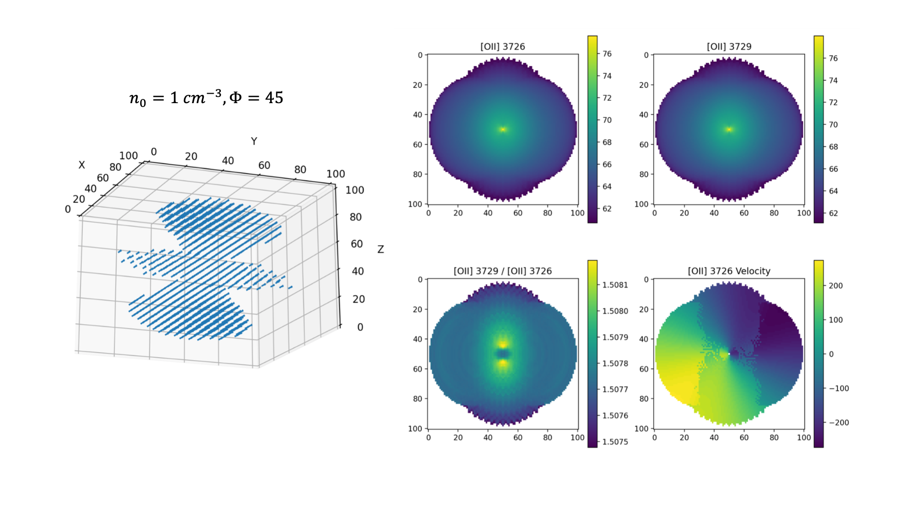

# Cloudy3D Simulation

## Step 1

For a Sersic disk with a circular velocity defined by the potential of the galactic halo and the disk, I will generate the line emission surface brightness, velocity when viewed face-on and edge-on. Especially I will include emissions of MgII, [OII], [NeIII], [NeV], [OIII] and H-beta.

The velocity of the disk is as follows.

Here are the computed emissions from [OII] and the projected velocities viewed with angles 30 and 80 degrees.

  
   

## Step 2

Add a galactic wind. 

 

Together with the rotating disk, the velocity looks like

 

The computed emissions from [OII] and the projected velocities viewed from an axis ratio of 0.8052 are

